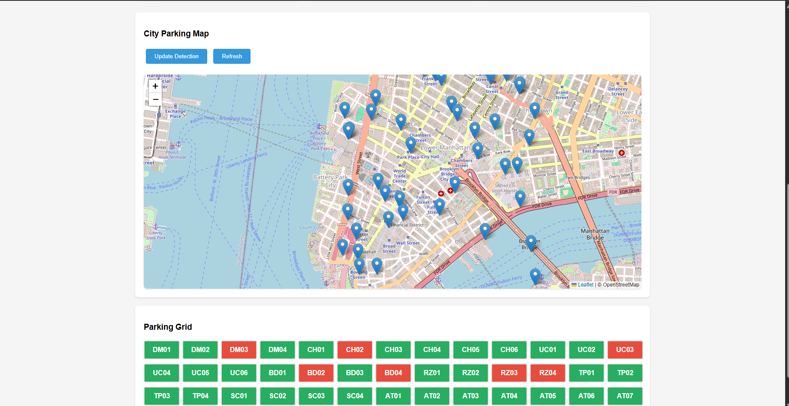
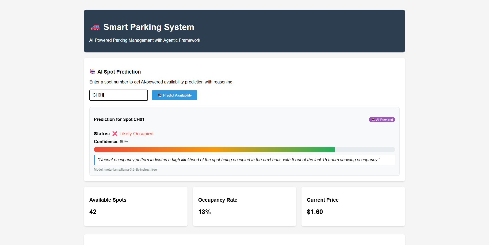

# Smart Parking System

## Setup Instructions

### Backend Setup (Python/Flask)

1. **Create Virtual Environment:**
   ```bash
   python -m venv venv
   venv\Scripts\activate  # On Windows
   # source venv/bin/activate  # On Linux/Mac
   ```

2. **Install Dependencies:**
   ```bash
   pip install -r requirements.txt
   ```

3. **Environment Configuration:**
   ```bash
   copy .env.example .env
   # Edit .env file with your configurations
   ```

4. **Run the Backend:**
   ```bash
   python smart_parking_backend.py
   ```
   
   The backend will be available at: http://localhost:5000

### Mobile App Setup (React Native/Expo)

1. **Install Node.js dependencies:**
   ```bash
   npm install
   # or
   yarn install
   ```

2. **Install Expo CLI (if not installed):**
   ```bash
   npm install -g expo-cli
   ```

3. **Start the development server:**
   ```bash
   npm start
   # or
   expo start
   ```

4. **Run on device:**
   - Install Expo Go app on your mobile device
   - Scan the QR code from the terminal
   - Or run `npm run android` / `npm run ios` for emulator

### Docker Setup (Optional)

1. **Build the container:**
   ```bash
   docker build -t smart-parking .
   ```

2. **Run the container:**
   ```bash
   docker run -p 5000:5000 smart-parking
   ```

## Project Structure

```
parking system/
├── smart_parking_backend.py   # Main Flask application
├── smart_parking_mobile.js    # React Native mobile app
├── requirements.txt           # Python dependencies
├── package.json              # Node.js dependencies  
├── Dockerfile                # Docker configuration
├── .env.example              # Environment variables template
└── README.md                 # This file
```

## Features

- **Real-time Parking Detection**: AI-powered computer vision
- **Dynamic Pricing**: Demand-based pricing algorithm
- **Mobile App**: Cross-platform React Native app
- **Web Dashboard**: Real-time monitoring interface
- **Predictive Analytics**: Occupancy prediction
- **Multi-Agent System**: Distributed AI architecture

## Screenshots

### City Parking Map


The interactive map shows real-time parking availability across the city with location markers indicating parking spots and their current status.

### Parking Grid Dashboard


The parking grid provides a quick overview of all parking spots with color-coded status indicators:
- 🟢 Green: Available spots
- 🔴 Red: Occupied spots  
- 🟡 Yellow: Reserved spots
- 🔵 Blue: Special categories (UC, BD, RZ, TP, SC, AT spots)

## API Endpoints

- `GET /` - Web dashboard
- `GET /api/status` - Current parking status
- `POST /api/update` - Trigger detection update
- `GET /api/predict/<spot_id>` - Predict availability
- `GET /api/find-parking` - Find best parking spot
- `GET /api/pricing/history` - Pricing history

## Development Notes

- The system runs in simulation mode by default for development
- Computer vision features use simulated data
- For production, replace simulation with actual camera feeds
- Database is SQLite for simplicity (can be upgraded to PostgreSQL)

## Troubleshooting

1. **Import Errors**: Make sure virtual environment is activated
2. **Port Issues**: Ensure port 5000 is available
3. **Database Issues**: Delete `parking.db` to reset database
4. **Mobile App Issues**: Clear Expo cache with `expo r -c`
